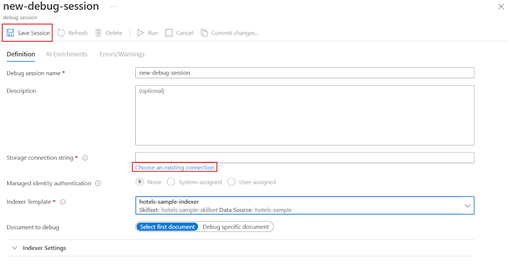
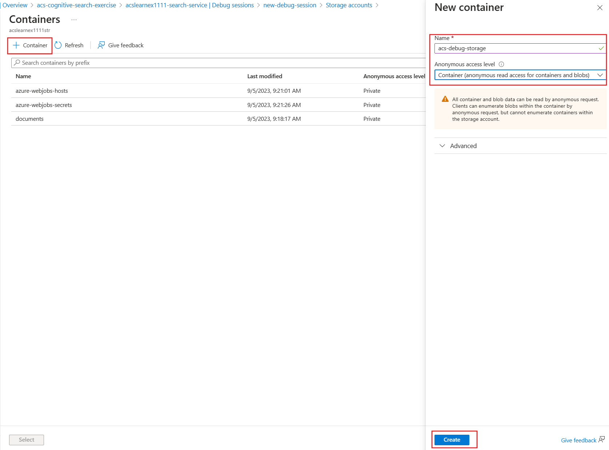
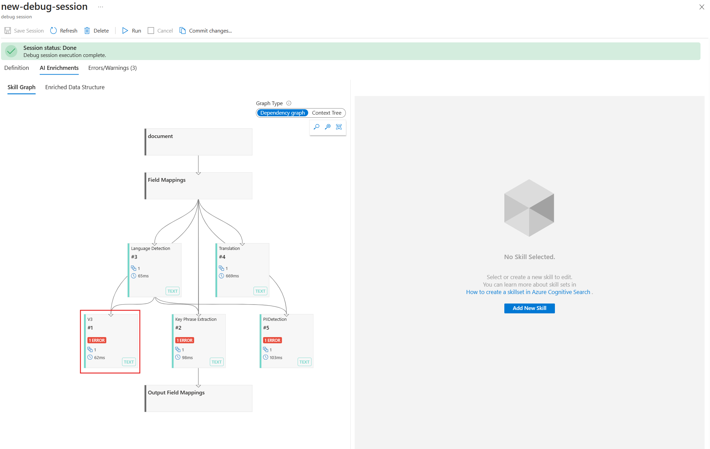
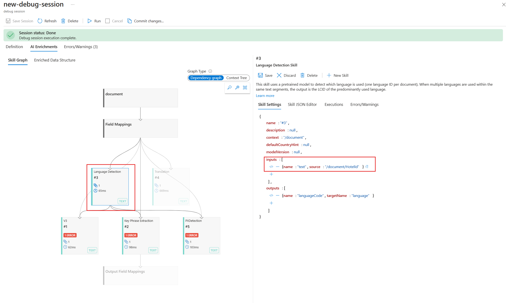
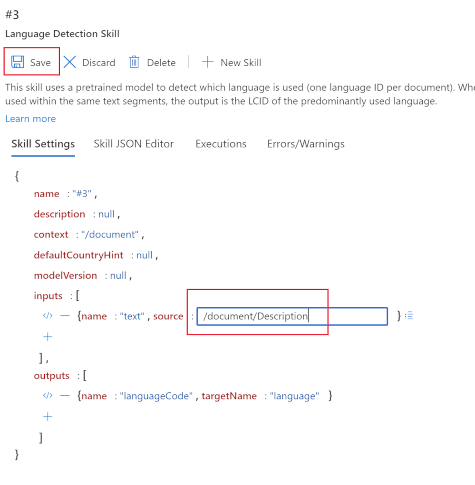
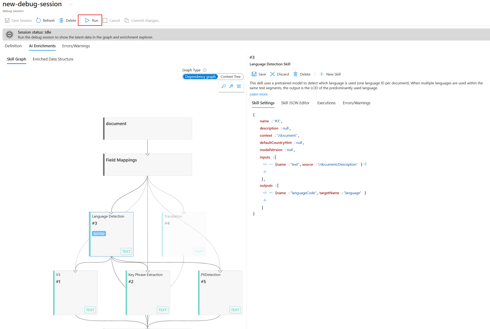
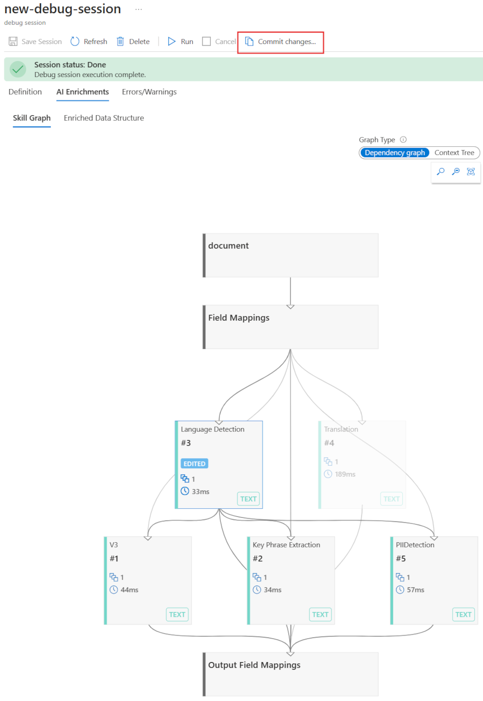

---
lab:
    title: 'Debug search issues'
---

# Debug search issues

You've built your search solution but have noticed that there are some warnings on the indexer.

In this exercise, you'll create an Azure AI Search solution, import some sample data, and then resolve a warning on the indexer.

> **Note**
> To complete this exercise, you will need a Microsoft Azure subscription. If you don't already have one, you can sign up for a free trial at [https://azure.com/free](https://azure.com/free?azure-portal=true).

## Create your search solution

Before you can begin using a Debug Session, you need to create an Azure Cognitive Search service.

1. [Deploy resources to Azure](https://portal.azure.com/#create/Microsoft.Template/uri/https%3A%2F%2Fraw.githubusercontent.com%2FMicrosoftLearning%2Fmslearn-knowledge-mining%2Fmain%2FLabfiles%2F08-debug-search%2Fazuredeploy.json) - select this link to deploy all the resources you need in the Azure portal.

    

1. Under **Resource Group**, select **Create new**.
1. Type **acs-cognitive-search-exercise**.
1. Select the closest **Region** to you.
1. For **Resource Prefix**, enter **acslearnex** and add a random combination of numbers or characters to ensure the storage name is unique.
1. For the Location, select the same region you used above.
1. At the bottom of the pane, select **Review + create**.
1. Wait until the resource is deployed, then select **Go to resource group**.

## Import sample data

With your resources created, you can now import your source data.

1. In the listed resources, select the search service.

1. On the **Overview** pane, select **Import data**.

      

1. On the import data pane, for the Data Source, select **Samples**.

      

1. In the list of samples, select **hotels-sample**.
1. Select **Next:Add cognitive skills (Optional)**.
1. Expand the **Add enrichments** section.

    

1. Select **Text Cognitive Skills**.
1. Select **Next:Customize target index**.
1. Leave the defaults, then select **Next:Create an indexer**.
1. Select **Submit**.

## Use a debug session to resolve warnings on your indexer

The indexer will now begin to ingest 50 documents. However, if you check the status of the indexer you'll find that there's warnings.

1. Select **Debug sessions** in the left pane.

1. Select **+ Add Debug Session**.

1. Select **Choose an existing connection** for  Storage connection string, then select your storage account.

    
1. Select **+ Container** to add a new container. Name it **acs-debug-storage**.

    

1. Set its **Anonymous access level** to **Container(anonymous read access for containers and blobs)**.

    > **Note**: You may need to enable blob anonymous in order to select this option. To do so, in the storage account go to **Configuration** , set **Allow Blob anonymous access** to **Enabled** and then select **Save**.

1. Select **Create**.
1. Select your new container in the list, then select **Select**.
1. Select **hotel-sample-indexer** for the **Indexer Template**.
1. Select **Save Session**.

    The dependency graph shows you that for each document there's an error on three skills.
    

1. Select **V3**.
1. On the skills details pane, select **Errors/Warnings(1)**.
1. Expand the **Message** column so you can see details.

    The details are:

    *Invalid language code '(Unknown)'. Supported languages: ar,cs,da,de,en,es,fi,fr,hu,it,ja,ko,nl,no,pl,pt-BR,pt-PT,ru,sv,tr,zh-Hans. For additional details see https://aka.ms/language-service/language-support.*

    If you look back at the dependency graph, the Language detection skill has outputs to the three skills with warnings. Also the skill input causing the error is `languageCode`.

1. In the dependency graph, select **Language detection**.

    
    Looking at the skill settings JSON, note the field being used to deduce the language is the `HotelId`.

    This field will be causing the error as the skill can't work out the language based on an ID.

## Resolve the warning on the indexer

1. Select **source** under inputs, and change the field to `/document/Description`.
    
1. Select **Save**.
1. Select **Run**.

    

    The indexer should no longer have any errors or warnings. The skillset can now be updated.

1. Select **Commit changes...**

    
1. Select **OK**.

1. Now you need to make sure that your skillset is attached to an Azure AI Services resource, otherwise you'll hit the basic quote and the indexer will timeout. To do this, select **Skillsets** in the left pane, then select your **hotels-sample-skillset**.

    
1. Select **Connect AI Service**, then select the AI services resource in the list.

    
1. Select **Save**.

1. Now run your indexer to update the documents with the fixed AI enrichments. To do this select **Indexers** in the left pane, select  **hotels-sample-indexer**, then select **Run**.  When it has finished running, you should see that the warnings are now zero.

    

### Clean-up

 Now you've completed the exercise, if you've finished exploring Azure AI Search services, delete the Azure resources that you created during the exercise. The easiest way to do this is delete the **acs-cognitive-search-exercise** resource group.
