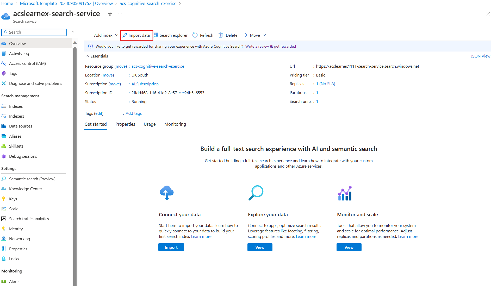
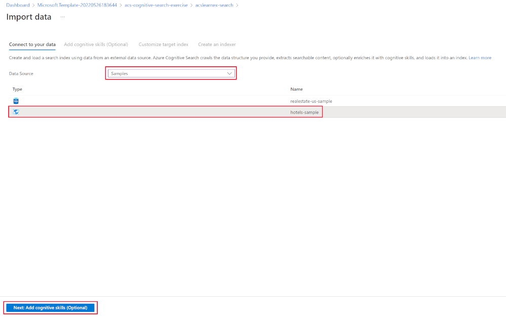
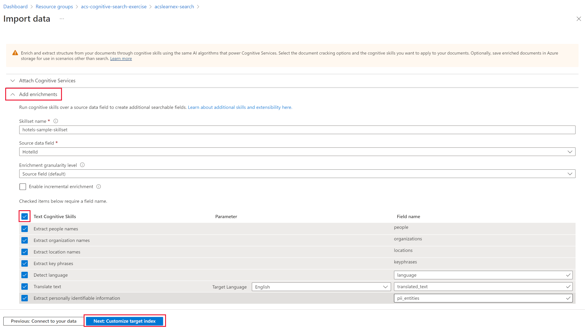
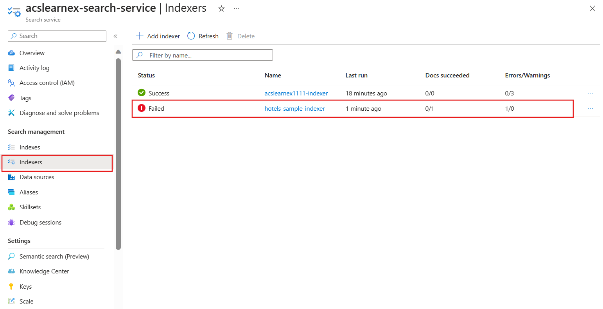
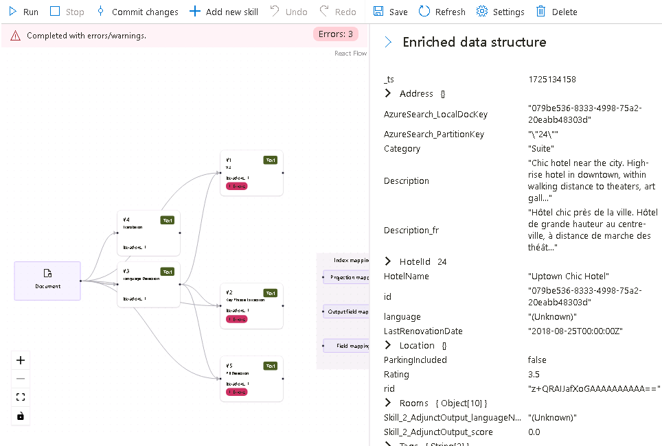
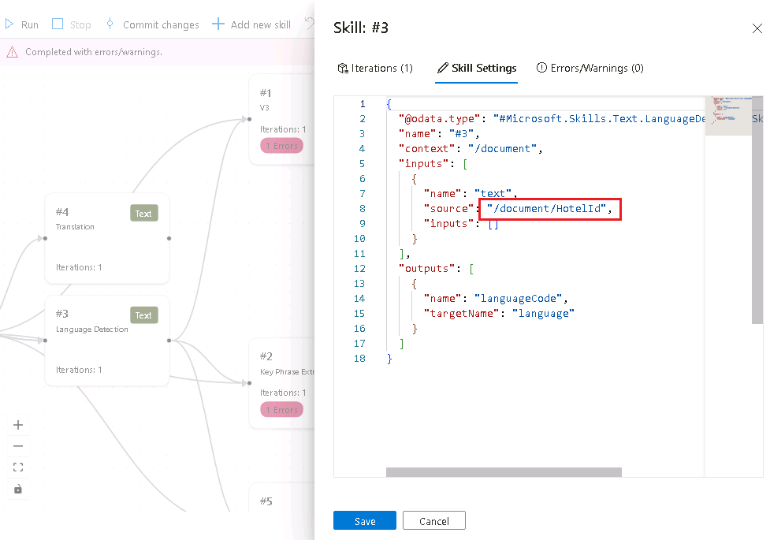
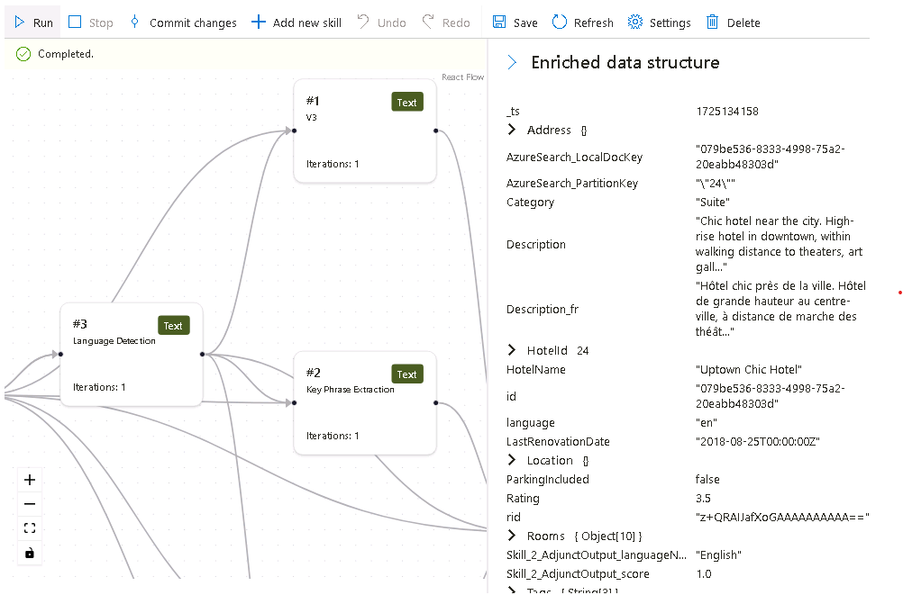
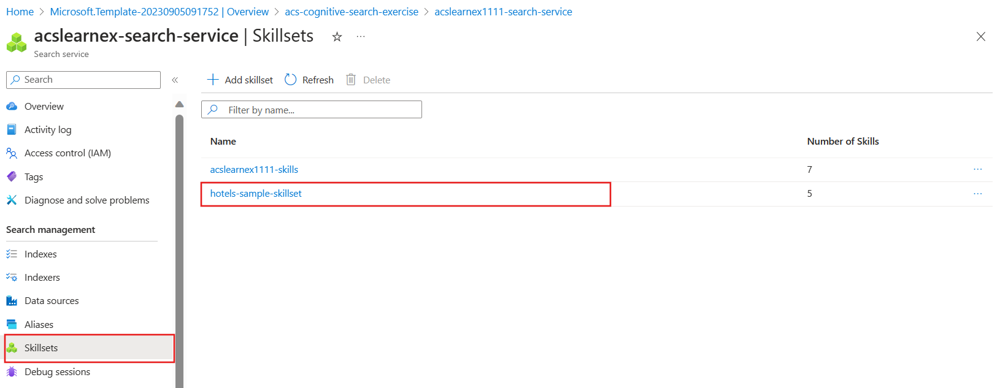
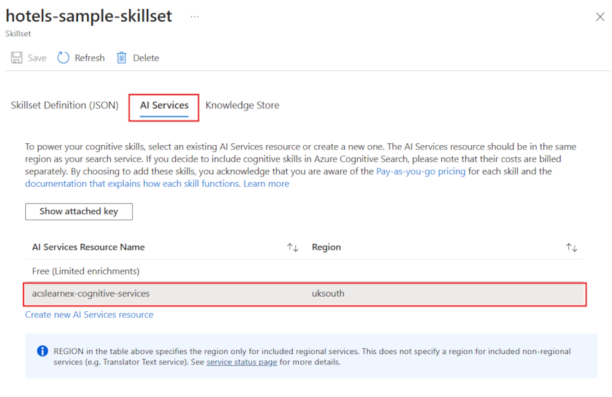
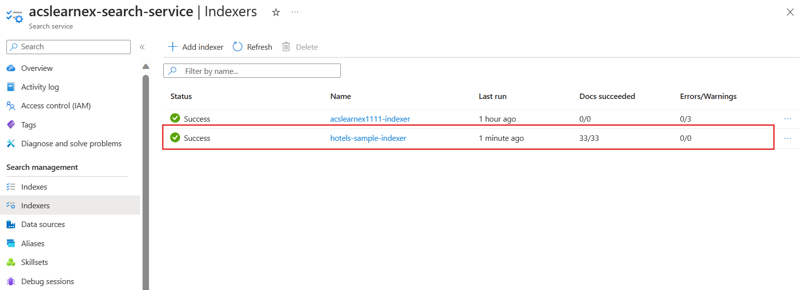

---
lab:
    title: 'Debug search issues'
---

# Debug search issues

You've built your search solution but have noticed that there are some warnings on the indexer.

In this exercise, you'll create an Azure AI Search solution, import some sample data, and then resolve a warning on the indexer.

> **Note**
> To complete this exercise, you will need a Microsoft Azure subscription. If you don't already have one, you can sign up for a free trial at [https://azure.com/free](https://azure.com/free?azure-portal=true).

## Create your search solution

Before you can begin using a Debug Session, you need to create an Azure AI Search service.

1. [Deploy resources to Azure](https://portal.azure.com/#create/Microsoft.Template/uri/https%3A%2F%2Fraw.githubusercontent.com%2FMicrosoftLearning%2Fmslearn-knowledge-mining%2Fmain%2FLabfiles%2F08-debug-search%2Fazuredeploy.json) - if you're in a hosted VM, copy this link and paste into the VM browser. Otherwise, select this link to deploy all the resources you need in the Azure portal.

    

1. Under **Resource Group**, select your provided resource group or select **Create new** and type **debug-search-exercise**.
1. Select the closest **Region** to you, or use the default.
1. For **Resource Prefix**, enter **debugsearch** and add a random combination of numbers or characters to ensure the storage name is unique.
1. For the Location, select the same region you used above.
1. At the bottom of the pane, select **Review + create**.
1. Wait until the resource is deployed, then select **Go to resource group**.

## Import sample data and configure resources

With your resources created, you can now import your source data.

1. In the listed resources, navigate to the storage account. Go to **Configuration** in the left pane, set **Allow Blob anonymous access** to **Enabled** and then select **Save**.
1. Navigate back to your resource group, and select the search service.
1. On the **Overview** pane, select **Import data**.

      

1. On the import data pane, for the Data Source, select **Samples**.

      

1. In the list of samples, select **hotels-sample**.
1. Select **Next:Add cognitive skills (Optional)**.
1. Expand the **Add enrichments** section.

    

1. Select **Text Cognitive Skills**.
1. Select **Next:Customize target index**.
1. Leave the defaults, then select **Next:Create an indexer**.
1. Select **Submit**.

## Use a debug session to resolve warnings on your indexer

The indexer will now begin to ingest 50 documents. However, if you check the status of the indexer you'll find that there's warnings.

1. Select **Debug sessions** in the left pane.
1. Select **+ Add Debug Session**.
1. Provide a name for the session, and select **hotel-sample-indexer** for the **Indexer Template**.
1. Select your storage account from the **Storage account** field. This will automatically create a storage container for you to hold the debug data.
1. Leave the checkbox for authenticating using a managed identity unchecked.
1. Select **Save**.
1. Once created, the debug session will automatically run on the data in your search service. It should complete with errors/warnings.

    The dependency graph shows you that for each document there's an error on three skills.
    

    > **Note**: You may see an error about connecting to the storage account and configuring managed identities. This happens if you try to debug too quickly after enabling anonymous blob access, and running the debug session should still work. Refreshing the browser window after a few minutes should remove the warning.

1. In the dependency graph, select one of the skill nodes that have an error.
1. On the skills details pane, select **Errors/Warnings(1)**.

    The details are:

    *Invalid language code '(Unknown)'. Supported languages: af,am,ar,as,az,bg,bn,bs,ca,cs,cy,da,de,el,en,es,et,eu,fa,fi,fr,ga,gl,gu,he,hi,hr,hu,hy,id,it,ja,ka,kk,km,kn,ko,ku,ky,lo,lt,lv,mg,mk,ml,mn,mr,ms,my,ne,nl,no,or,pa,pl,ps,pt-BR,pt-PT,ro,ru,sk,sl,so,sq,sr,ss,sv,sw,ta,te,th,tr,ug,uk,ur,uz,vi,zh-Hans,zh-Hant. For additional details see https://aka.ms/language-service/language-support.*

    If you look back at the dependency graph, the Language Detection skill has outputs to the three skills with errors. If you look at the skill settings with errors, you'll see the skill input causing the error is `languageCode`.

1. In the dependency graph, select **Language detection**.

    
    Looking at the skill settings JSON, note the field being used to deduce the language is the `HotelId`.

    This field will be causing the error as the skill can't work out the language based on an ID.

## Resolve the warning on the indexer

1. Select **source** under inputs, and change the field to `/document/Description`.
1. Select **Save**.
1. Select **Run**. The indexer should no longer have any errors or warnings. The skillset can now be updated.

    
   
1. Select **Commit changes** to push the changes made in this session to your indexer.
1. Select **OK**. You can now delete your session.

Now you need to make sure that your skillset is attached to an Azure AI Services resource, otherwise you'll hit the basic quota and the indexer will timeout. 

1. To do this, select **Skillsets** in the left pane, then select your **hotels-sample-skillset**.

    
1. Select **Connect AI Service**, then select the AI services resource in the list.

    
1. Select **Save**.

1. Now run your indexer to update the documents with the fixed AI enrichments. To do this select **Indexers** in the left pane, select  **hotels-sample-indexer**, then select **Run**.  When it has finished running, you should see that the warnings are now zero.

    

## Clean-up

 Now you've completed the exercise, if you've finished exploring Azure AI Search services, delete the Azure resources that you created during the exercise. The easiest way to do this is delete the **debug-search-exercise** resource group.
