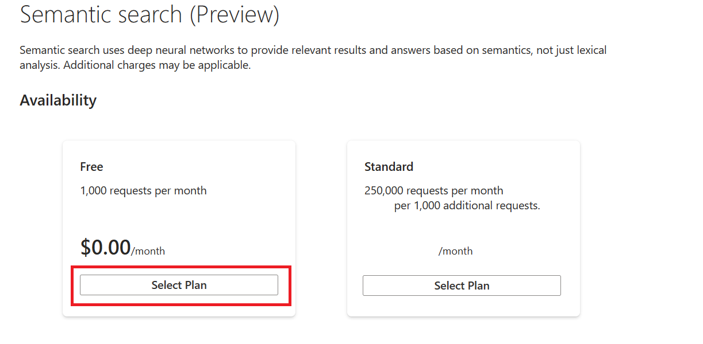
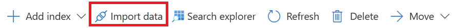
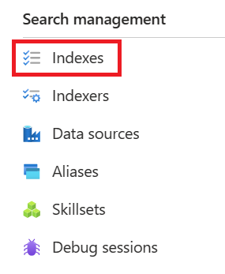

---
lab:
    title: 'Set up semantic ranker'
---

# Set up semantic ranker

> **Note**
> To complete this lab, you will need an [Azure subscription](https://azure.microsoft.com/free?azure-portal=true) in which you have administrative access. This exercise also requires the **Azure AI Search** service with a billable tier.

In this exercise, you will add semantic ranker to an index and use semantic ranker for a query.

## Enable semantic ranker

1. Open the Azure portal and sign in.
1. Select **All resources** and select your search service.
1. In the navigation pane, select **Semantic ranker**.
1. In **Availability**, in the **Free** option, select **Select Plan**.



## Import a sample index

1. Return to the **Overview** page of your search service.
1. Select **Import data**.

    

1. In **Data Source**, select **Samples**.
1. Select **hotels-sample** and select **Next: Add cognitive skills (Optional)**.
1. Select **Skip to: Customize target index**.
1. Select **Next: Create an indexer**.
1. Select **Submit**.

## Configure semantic ranking

Once you have a search index and semantic ranker enabled, you can configure semantic ranking. You require a search client that supports preview APIs on the query request. You could use Search explorer in the Azure portal, the Postman app, the Azure SDK for .NET, or the Azure SDK for Python. In this exercise, you will use Search explorer in the Azure portal.

To configure semantic ranking, follow these steps:

1. On the navigation bar, in **Search management**, select **Indexes**.

    

1. Select your index.
1. Select **Semantic configurations** and select **Add semantic configuration**.
1. In **Name** type **hotels-conf**.
1. In **Title field** select **HotelName**.
1. Under **Content fields**, in **Field name**, select **Description**.
1. Repeat the previous step for the following fields:
    - **Category**
    - **Address/City**
1. Under **Keyword fields**, in **Field name**, select **Tags**.
1. Select **Save**.
1. On your index page, select **Save**.
1. Select **Search explorer**.
1. Select **View** and select **JSON view**.
1. In JSON query editor type the following text:

    ```json
        {
         "queryType": "semantic",
         "queryLanguage" : "en-us",
         "search": "all hotels near the water" , 
         "semanticConfiguration": "hotels-conf" , 
         "searchFields": "",
         "speller": "lexicon" , 
         "answers": "extractive|count-3",
         "count": true
        }
    ```

1. Select **Search**.
1. Review the results of the query.

## Clean-up

If you no longer require the Azure AI Search service, you should delete the resource from your Azure subscription to reduce costs.

>**Note**
> Deleting your Azure AI Search service ensures your subscription won't be charged for resources. You will however be charged a small amount for data storage as long as the storage exists in your subscription. If you have finished exploring the Cognitive Search service, you can delete the Cognitive Search service and associated resources. However, if you plan to complete any other labs in this series, you will need to recreate it.
> To delete your resources:
> 1. In the [Azure portal](https://portal.azure.com?azure-portal=true ), in the **Resource groups** page, open the resource group you specified when creating your Cognitive Search service.
> 1. Click **Delete resource group**, type the resource group name to confirm you want to delete it, and select **Delete**.
