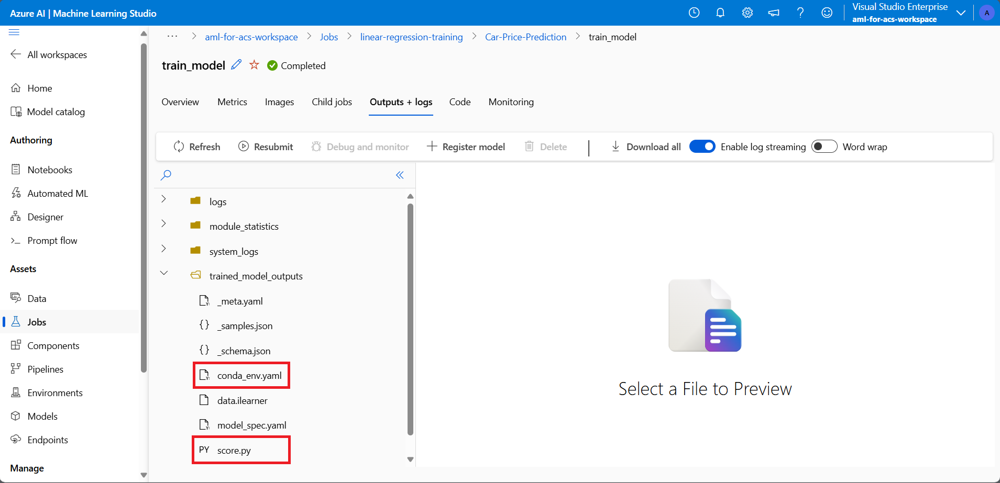

---
lab:
    title: 'Enrich a search index using Azure Machine Learning model'
---

# Enrich a search index using Azure Machine Learning model

You can use the power of machine learning to enrich a search index. To do this, you'll use a model trained in Azure AI Machine Learning studio and call it from a machine learning custom skillset.

In this exercise, you'll create an Azure AI Machine Learning Studio model, then train, deploy, and test an endpoint using the model. Then you'll create an Azure Cognitive Search service, create sample data, and enrich an index using the Azure AI Machine Learning studio endpoint.

> **Note**
>To complete this exercise, you will need a Microsoft Azure subscription. If you don't already have one, you can sign up for a free trial at [https://azure.com/free](https://azure.com/free?azure-portal=true).
>

## Create an Azure Machine Learning workspace

Before you enrich your search index, create an Azure Machine Learning workspace. The workspace will give you access to the Azure AI Machine Learning studio, a graphical tool you can use to build AI models and deploy them for use.

1. Sign into the [Azure portal](https://portal.azure.com).
1. Select **+ Create a resource**.
1. Search for machine learning, and then select **Azure Machine Learning**.
1. Select **Create**.
1. Select **Create new** under **Resource group** and name it **aml-for-acs-enrichment**.
1. In the Workspace details section, for **Name**, enter **aml-for-acs-workspace**.
1. Select a supported **Region** near to you.
1. Use the default values for the **Storage account**, **Key vault**, **Application insights**, and **Container registry**.
1. Select **Review + create**.
1. Select **Create**.
1. Wait for the Azure Machine Learning workspace to be deployed, then select **Go to resource**.
1. On the Overview pane, select **Launch studio**.

## Create a regression training pipeline

You'll now create a regression model and train it using an Azure AI Machine Learning Studio pipeline. You'll train your model on automobile price data. The model, once trained, will predict the price of an automobile based on its attributes.

1. On the home page, select **Designer**.
1. On the **Designer** page, select **Create a new pipeline using classic prebuilt components**.

    

1. Change the default pipeline name (**Pipeline-Created-on-*date***) to `Car-Price-Prediction` by selecting the pencil icon on its right.
1. In the asset library panel, select the **Components** tab and expand the **Sample data** asset group.

>**NOTE**: If the asset library is collapsed, you can expand it by selecting the **>>** icon in the top toolbar.

1. Drag and drop the **Automobile price data (Raw)** component onto the canvas.
1. Expand the **Data Transformation** asset group and drag and drop the **Clean Missing Data** component onto the canvas, below **automobile_price_raw**.
1. Connect the data output to the input of the new component.
1. Select the **Clean Missing Data** component and select **Edit column** in the right panel.

>**NOTE**: You may need to expand the panel by selecting the **Expand** icon in the top-right corner of the canvas.

1. In the **Columns to be cleaned** window, in the **Include** row, select **All columns** in the dropdown menu and select **Save**. You can also close the right panel.
1. Still in the **Data Transformation** asset group, drag and drop the **Split Data** component onto the canvas, below **Clean Missing Data**.
1. Connect the **Cleaned dataset** output to the input of the new component.
1. Expand the **Model Training** asset group and drag and drop the **Train Model** component onto the canvas, below **Split Data**.
1. Connect the **Results dataset1** output to the **Dataset** input of the new component.
1. Select the **Train Model** component and select **Edit column** in the right panel.
1. In the **Enter column name** field, enter `price` and select **Save**.
1. Expand the **Machine Learning Algorithms** asset group and drag and drop the **Linear Regression** component onto the canvas, next to **Split Data**.
1. Connect the **Untrained model** output of the new component to the input of the **Train Model** component.
1. Expand the **Model Scoring & Evaluation** asset group and drag and drop the **Score Model** component onto the canvas, below **Train Model**.
1. Connect the **Trained model** output to the input of the new component and the **Results dataset2** output from **Split Data** to the **Dataset** input of the new component.
1. Still in the **Model Scoring & Evaluation** asset group, drag and drop the **Evaluate Model** component onto the canvas, below **Score Model**.
1. Connect the **Scored dataset** output to the left input of the new component.
1. Review your pipeline, it should look like the following:

    

1. Select **Validate**.
1. On the **Graph validation** pane, select the error **Select compute target in submission wizard**.

    

1. In the **Select compute type** dropdown, choose **Compute instance**. Then select **Create Azure ML compute instance** underneath.
1. In the **Compute name** field, enter a unique name (such as **compute-for-training**).
1. Select **Review + create**, then select **Create**.
1. In the **Select Azure ML compute instance** field, select your instance from the dropdown. You might need to wait until it has finished provisioning.
1. Select **Basics** in the **Set up pipeline job** pane.
1. Select **Create new** under the Experiment name.
1. In **New experiment name**, enter **linear-regression-training**.
1. Select **Review + Submit** , then select **Submit**.

### Create an inference cluster for the endpoint

While your pipeline is training a linear regression model, you can create the resources you need for the endpoint. This endpoint needs a Kubernetes cluster to process web requests to your model.

1. On the left, select **Compute**.

    
1. Select **Kubernetes clusters**, then select **+ New**.
1. In the dropdown, select **AksCompute**.
1. On the **Create AksCompute** pane, select **Create new**.
1. For **Location**, select the same region you used to create your other resources.
1. In the VM sizes list, select **Standard_A2_v2**.
1. Select **Next**.
1. In **Compute name**, enter **aml-acs-endpoint**.
1. Select **Enable SSL configuration**.
1. In **Leaf domain**, enter **aml-for-acs**.
1. Select **Create**.

### Register your trained model

Your pipeline job should have finished. You'll download the `score.py` and `conda_env.yaml` files. Then you'll register your trained model.

1. On the left, select **Jobs**.
1. Select your experiment, then expand your completed job and select the **train_model** child-job.

    

1. In the **Outputs + logs** tab, expand the **trained_model_outputs** folder.
1. Next to `score.py`, select the more menu (**...**), then select **Download**.
1. Next to `conda_env.yaml`, select the more menu (**...**), then select **Download**.
1. Select **+ Register model** at the top of the tab.
1. In the **Job output** field, select the **trained_model_outputs** folder. Then select **Next** at the bottom of the pane.
1. For model **Name**, enter **carevalmodel**.
1. In **Description**, enter **A linear regression model to predict the price of cars.**.
1. Select **Next**.
1. Select **Register**.

### Edit the scoring script to respond to Azure AI Search correctly

Azure Machine Learning Studio has downloaded two files to your web browser's default download location. You need to edit the score.py file to change how the JSON request and response are handled. You can use a text editor or a code editor like Visual Studio Code.

1. In your editor, open the score.py file.
1. Replace all the contents of the run function:

    ```python
    def run(data):
    data = json.loads(data)
    input_entry = defaultdict(list)
    for row in data:
        for key, val in row.items():
            input_entry[key].append(decode_nan(val))

    data_frame_directory = create_dfd_from_dict(input_entry, schema_data)
    score_module = ScoreModelModule()
    result, = score_module.run(
        learner=model,
        test_data=DataTable.from_dfd(data_frame_directory),
        append_or_result_only=True)
    return json.dumps({"result": result.data_frame.values.tolist()})
    ```

    With this Python code:

    ```python
    def run(data):
        data = json.loads(data)
        input_entry = defaultdict(list)
        
        for key, val in data.items():
                input_entry[key].append(decode_nan(val))
    
        data_frame_directory = create_dfd_from_dict(input_entry, schema_data)
        score_module = ScoreModelModule()
        result, = score_module.run(
            learner=model,
            test_data=DataTable.from_dfd(data_frame_directory),
            append_or_result_only=True)
        output = result.data_frame.values.tolist()
        
        return {
                "predicted_price": output[0][-1]
        }    
    ```

    The changes above allow the mode to receive a single JSON object with car attributes instead of an array of cars.

    The other change is to only return the predicted price of the car instead of the whole JSON response.
1. Save the changes in your text editor.

## Create a custom environment

Next, you'll create a custom environment so you can deploy to a real-time endpoint.

1. Select **Environments** in the navigation pane.
1. Select the **Custom environments** tab.
1. Select **+ Create**.
1. For **Name**, enter **my-custom-environment**.
1. In the list of *Curated environments* under **Select environment type**, select the latest **automl-gpu** version.
1. Select **Next**.
1. On your local machine, open the `conda_env.yaml` file you downloaded earlier and copy its contents.
1. Return to browser, and select **conda_dependencies.yaml** in the Customize pane.
1. In the pane on the right, replace its contents with the code you copied earlier.
1. Select **Next**, then select **Next** again.
1. Select **Create** to create your custom environment.

## Deploy the model with the updated scoring code <!--Option for web service deployment is greyed out. Can't go further after trying several different things.-->

Your inference cluster should now be ready to use. You've also edited the scoring code to handle requests from your Azure Cognitive Search custom skillset. Let's create and test an endpoint for the model.

1. On the left, select **Models**.
1. Select the model you registered, **carevalmodel**.

1. Select **Deploy**, then select **Real-time endpoint**.

    
1. For **Endpoint name**, enter a unique name, for example **car-evaluation-endpoint-1440637584** .
1. For **Compute type**, select **Managed**.
1. For **Authentication type**, select **Key-based**.
1. Select **Next**, then select **Next**.
1. Select **Next** again.
1. In the **Select a scoring script for inferencing** field, browse to your updated `score.py` file and select it.
1. In the **Select environment type** dropdown, select **Custom enviroments**.
1. Select the checkbox on your custom environment from the list.
1. Select **Next**.
1. For Virtual machine, select **Standard_D2as_v4**.
1. Set **Instance count** to **1**.
1. Select **Next**,  then select **Next** again.
1. Select **Create**.

Wait for the model to be deployed, it can take up to 10 minutes. You can check the status in **Notifications** or the endpoints section of the Azure Machine Learning Studio.

### Test your trained model's endpoint

1. On the left, select **Endpoints**.
1. Select **car-evaluation-endpoint**.
1. Select **Test**, in **Input data to test endpoint** paste this example JSON.

    ```json
    {
        "symboling": 2,
        "make": "mitsubishi",
        "fuel-type": "gas",
        "aspiration": "std",
        "num-of-doors": "two",
        "body-style": "hatchback",
        "drive-wheels": "fwd",
        "engine-location": "front",
        "wheel-base": 93.7,
        "length": 157.3,
        "width": 64.4,
        "height": 50.8,
        "curb-weight": 1944,
        "engine-type": "ohc",
        "num-of-cylinders": "four",
        "engine-size": 92,
        "fuel-system": "2bbl",
        "bore": 2.97,
        "stroke": 3.23,
        "compression-ratio": 9.4,
        "horsepower": 68.0,
        "peak-rpm": 5500.0,
        "city-mpg": 31,
        "highway-mpg": 38,
        "price": 0.0
    }
    ```

1. Select **Test**, and you should see a response:

    ```json
    {
        "predicted_price": 5852.823214312815
    }
    ```

1. Select **Consume**.

    
1. Copy the **REST endpoint**.
1. Copy the **Primary key**.

### Integrate an Azure Machine Learning model with Azure AI Search

Next, you create a new Cognitive Search service and enrich an index using a custom skillset.

### Create a test file

1. In the [Azure portal](https://portal.azure.com/learn.docs.microsoft.com?azure-portal=true), select Resource groups.
1. Select **aml-for-acs-enrichment**.

    
1. Select the storage account, for example **amlforacsworks1440637584**.
1. Select **Configuration** under **Settings**. Then set **Allow Blob anonymous access** to **Enabled**.
1. Select **Save**.
1. Under **Data storage**, select **Containers**. 
1. Create a new container to store index data, select **+ Container**.
1. In the **New container** pane, in **Name**, enter **docs-to-search**.
1. In **Anonymous access level**, select **Container (anonymous read access for containers and blobs)**.
1. Select **Create**.
1. Select the **docs-to-search** container you created.
1. In a text editor, create a JSON document:

    ```json
    {
      "symboling": 0,
      "make": "toyota",
      "fueltype": "gas",
      "aspiration": "std",
      "numdoors": "four",
      "bodystyle": "wagon",
      "drivewheels": "fwd",
      "enginelocation": "front",
      "wheelbase": 95.7,
      "length": 169.7,
      "width": 63.6,
      "height": 59.1,
      "curbweight": 2280,
      "enginetype": "ohc",
      "numcylinders": "four",
      "enginesize": 92,
      "fuelsystem": "2bbl",
      "bore": 3.05,
      "stroke": 3.03,
      "compressionratio": 9.0,
      "horsepower": 62.0,
      "peakrpm": 4800.0,
      "citympg": 31,
      "highwaympg": 37,
      "price": 0
    }
    ```

    Save the document to your machine as `test-car.json` extension.
1. In the portal, select **Upload**.
1. In the **Upload blob** pane, select **Brows for files**, navigate to where you saved the JSON document, and select it.
1. Select **Upload**.

### Create an Azure AI Search resource

1. In the Azure portal, on the home page, select **+ Create a resource**.
1. Search for **Azure AI Search**, then select **Azure AI Search**.
1. Select **Create**.
1. In **Resource Group**, select **aml-for-acs-enrichment**.
1. In Service name, enter a unique name, for example **acs-enriched-1440637584**.
1. For **Location**, select the same region you used earlier.
1. Select **Review + create**, then select **Create**.
1. Wait for the resources to be deployed, then select **Go to resource**.
1. Select **Import data**.
1. On the **Connect to your data** pane, for the **Data source** field, select **Azure Blob Storage**.
1. In **Data source name**, enter **import-docs**.
1. In **Parsing mode**, select **JSON**.
1. In **Connection string**, select **Choose an existing connection**.
1. Select the storage account you uploaded to, for example, **amlforacsworks1440637584**.
1. In the **Containers** pane, select **docs-to-search**. 
1. Select **Select**.
1. Select **Next: Add cognitive skills (Optional)**.

### Add cognitive skills

1. Expand **Add enrichments**, then select **Extract people names**.
1. Select **Next: Customize target index**.
1. Select **+ Add field**, in the **Field name** enter **predicted_price** at the bottom of the list.
1. In **Type**, select **Edm.Double** for your new entry.
1. Select **Retrievable** for all fields.
1. Select **Searchable** for **make**.
1. Select **Next: Create an indexer**.
1. Select **Submit**.

## Add the AML Skill to the skillset

You'll now replace the people names enrichment with the Azure Machine Learning custom skillset.

1. On the Overview pane, select **Skillsets** under **Search management**.
1. Under **Name**, select **azureblob-skillset**.
1. Replace the skills definition for the `EntityRecognitionSkill` with this JSON, remember to replace your copied endpoint and primary key values:

    ```json
    "@odata.type": "#Microsoft.Skills.Custom.AmlSkill",
    "name": "AMLenricher",
    "description": "AML studio enrichment example",
    "context": "/document",
    "uri": "PASTE YOUR AML ENDPOINT HERE",
    "key": "PASTE YOUR PRIMARY KEY HERE",
    "resourceId": null,
    "region": null,
    "timeout": "PT30S",
    "degreeOfParallelism": 1,
    "inputs": [
      {
        "name": "symboling",
        "source": "/document/symboling"
      },
      {
        "name": "make",
        "source": "/document/make"
      },
      {
        "name": "fuel-type",
        "source": "/document/fueltype"
      },
      {
        "name": "aspiration",
        "source": "/document/aspiration"
      },
      {
        "name": "num-of-doors",
        "source": "/document/numdoors"
      },
      {
        "name": "body-style",
        "source": "/document/bodystyle"
      },
      {
        "name": "drive-wheels",
        "source": "/document/drivewheels"
      },
      {
        "name": "engine-location",
        "source": "/document/enginelocation"
      },
      {
        "name": "wheel-base",
        "source": "/document/wheelbase"
      },
      {
        "name": "length",
        "source": "/document/length"
      },
      {
        "name": "width",
        "source": "/document/width"
      },
      {
        "name": "height",
        "source": "/document/height"
      },
      {
        "name": "curb-weight",
        "source": "/document/curbweight"
      },
      {
        "name": "engine-type",
        "source": "/document/enginetype"
      },
      {
        "name": "num-of-cylinders",
        "source": "/document/numcylinders"
      },
      {
        "name": "engine-size",
        "source": "/document/enginesize"
      },
      {
        "name": "fuel-system",
        "source": "/document/fuelsystem"
      },
      {
        "name": "bore",
        "source": "/document/bore"
      },
      {
        "name": "stroke",
        "source": "/document/stroke"
      },
      {
        "name": "compression-ratio",
        "source": "/document/compressionratio"
      },
      {
        "name": "horsepower",
        "source": "/document/horsepower"
      },
      {
        "name": "peak-rpm",
        "source": "/document/peakrpm"
      },
      {
        "name": "city-mpg",
        "source": "/document/citympg"
      },
      {
        "name": "highway-mpg",
        "source": "/document/highwaympg"
      },
      {
        "name": "price",
        "source": "/document/price"
      }
    ],
    "outputs": [
      {
        "name": "predicted_price",
        "targetName": "predicted_price"
      }
    ]  
    ```

1. Select **Save**.

### Update the output field mappings

1. Go back to the **Overview** pane of your search service, and select **Indexers**, then select the **azureblob-indexer**.
1. Select the **Indexer Definition (JSON)** tab, then change the **outputFieldMappings** value to:

    ```json
    "outputFieldMappings": [
        {
          "sourceFieldName": "/document/predicted_price",
          "targetFieldName": "predicted_price"
        }
      ]
    ```

1. Select **Save**.
1. Select **Reset**, then select **Yes**.
1. Select **Run**, then select **Yes**.

## Test index enrichment

The updated skillset will now add a predicted value to the test car document in your index. To test this, follow these steps.

1. On the **Overview** pane of your search service, select **Search explorer** at the top of the pane.
1. Select **Search**.
1. Scroll to the bottom of the results.
    
You should see the populated field `predicted_price`.

## Clean-up

Now that you've completed the exercise, delete all the resources you no longer need. Delete the Azure resources:

1. In the Azure portal, select **Resource groups**.
1. Select the resource group you don't need, then select **Delete resource group**.
