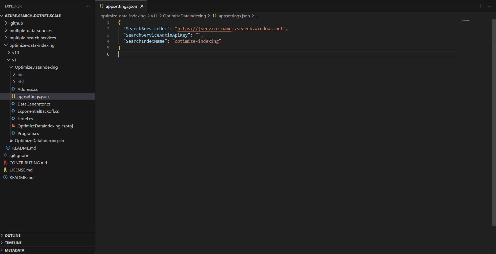
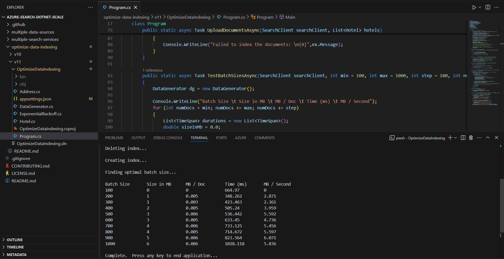
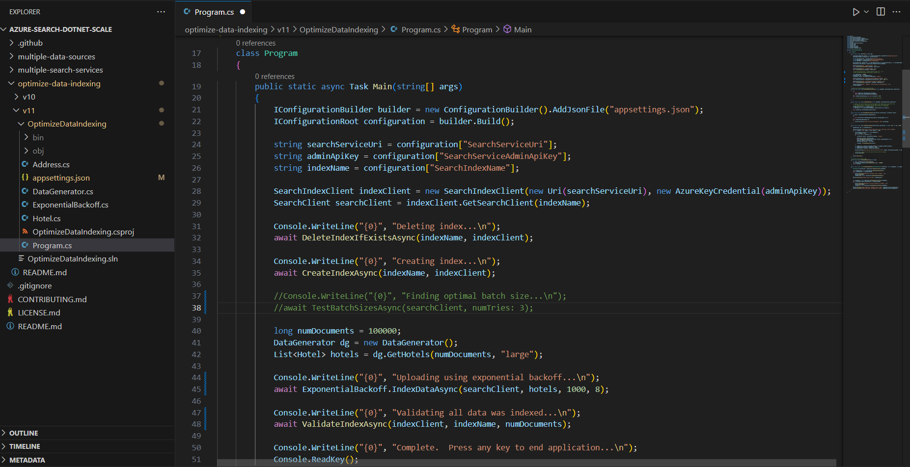

---
lab:
    title: 'Add to an index using the push API'
---

# Add to an index using the push API

You want to explore how to create an Azure AI Search index and upload documents to that index using C# code.

In this exercise, you'll clone an existing C# solution and run it to work out the optimal batch size to upload documents. You'll then use this batch size and upload documents effectively using a threaded approach.

> **Note**
>To complete this exercise, you will need a Microsoft Azure subscription. If you don't already have one, you can sign up for a free trial at [https://azure.com/free](https://azure.com/free?azure-portal=true).

## Set up your Azure resources

To save you time, select this Azure Resource Manager template to create resources you'll need later in the exercise:

1. [Deploy resources to Azure](https://portal.azure.com/#create/Microsoft.Template/uri/https%3A%2F%2Fraw.githubusercontent.com%2FMicrosoftLearning%2Fmslearn-knowledge-mining%2Fmain%2FLabfiles%2F07-exercise-add-to-index-use-push-api%2Fazuredeploy.json) - select this link to create your Azure AI resources.
    
1. In **Resource group**, select **Create new**, name it **cog-search-language-exe**.
1. In **Region**, select a [supported region](/azure/ai-services/language-service/custom-text-classification/service-limits#regional-availability) that is close to you.
1. The **Resource Prefix** needs to be globally unique, enter a random numeric and lower-case character prefix, for example, **acs118245**.
1. In **Location**, select the same region you chose above.
1. Select **Review + create**.
1. Select **Create**.
1. When deployment has finished, select **Go to resource group** to see all the resources that you've created.

    

## Copy Azure AI Search service REST API information

1. In the list of resources, select the search service you created. In the above example **acs118245-search-service**.
1. Copy the search service name into a text file.

    
1. On the left, select **Keys**, then copy the **Primary admin key** into the same text file.

## Clone the repository in Cloud Shell

You'll develop your code using Cloud Shell from the Azure Portal. The code files for your app have been provided in a GitHub repo.

> **Tip**: If you have already cloned the **mslearn-knowledge-mining** repo recently, you can skip this task. Otherwise, follow these steps to clone it to your development environment.

1. In the Azure Portal, use the **[\>_]** button to the right of the search bar at the top of the page to create a new Cloud Shell in the Azure portal, selecting a ***PowerShell*** environment. The cloud shell provides a command line interface in a pane at the bottom of the Azure portal.

    > **Note**: If you have previously created a cloud shell that uses a *Bash* environment, switch it to ***PowerShell***.

1. In the cloud shell toolbar, in the **Settings** menu, select **Go to Classic version** (this is required to use the code editor).

    > **Tip**: As you paste commands into the cloudshell, the ouput may take up a large amount of the screen buffer. You can clear the screen by entering the `cls` command to make it easier to focus on each task.

1. In the PowerShell pane, enter the following commands to clone the GitHub repo for this exercise:

    ```
    rm -r mslearn-knowledge-mining -f
    git clone https://github.com/microsoftlearning/mslearn-knowledge-mining mslearn-knowledge-mining
    ```

1. After the repo has been cloned, navigate to the folder containing the application code files:  

    ```
   cd mslearn-knowledge-mining/Labfiles/07-exercise-add-to-index-use-push-api/OptimizeDataIndexing
    ```

## Set up your application

1. Using the `ls` command, you can view the contents of the **OptimizeDataIndexing** folder. Note that it contains a `appsettings.json` file for configuration settings.

1. Enter the following command to edit the configuration file that has been provided:

    ```
   code appsettings.json
    ```

    The file is opened in a code editor.

    

1. Paste in your search service name and primary admin key.

    ```json
    {
      "SearchServiceUri": "https://acs118245-search-service.search.windows.net",
      "SearchServiceAdminApiKey": "YOUR_SEARCH_SERVICE_KEY",
      "SearchIndexName": "optimize-indexing"
    }
    ```

    The settings file should look similar to the above.
   
1. After you've replaced the placeholders, use the **CTRL+S** command to save your changes and then use the **CTRL+Q** command to close the code editor while keeping the cloud shell command line open.
1. In the terminal, enter `dotnet run` and press **Enter**.

    

    The output shows that in this case, the best performing batch size is 900 documents with the highest transfer rate (MB / Second).
   
    >**Note**: Your transfer rate values may be different from what is shown in the screenshot. However, the best performing batch size should still be the same. 

## Edit the code to implement threading and a backoff and retry strategy

There's code commented out that's ready to change the app to use threads to upload documents to the search index.

1. Enter the following command to open the code file for the client application:

    ```
   code Program.cs
    ```

1. Comment out lines 38 and 39 like this:

    ```csharp
    //Console.WriteLine("{0}", "Finding optimal batch size...\n");
    //await TestBatchSizesAsync(searchClient, numTries: 3);
    ```

1. Uncomment lines 41 to 49.

    ```csharp
    long numDocuments = 100000;
    DataGenerator dg = new DataGenerator();
    List<Hotel> hotels = dg.GetHotels(numDocuments, "large");

    Console.WriteLine("{0}", "Uploading using exponential backoff...\n");
    await ExponentialBackoff.IndexDataAsync(searchClient, hotels, 1000, 8);

    Console.WriteLine("{0}", "Validating all data was indexed...\n");
    await ValidateIndexAsync(indexClient, indexName, numDocuments);
    ```

    The code that controls the batch size and number of threads is `await ExponentialBackoff.IndexDataAsync(searchClient, hotels, 1000, 8)`. The batch size is 1000 and the threads are eight.

    

    Your code should look like the above.

1. Save your changes.
1. Select your terminal, then press any key to end the running process if you haven't already.
1. Run `dotnet run` in the terminal.

    The app will start eight threads, and then as each thread finishes writing a new message to the console:

    ```powershell
    Finished a thread, kicking off another...
    Sending a batch of 1000 docs starting with doc 57000...
    ```

    After 100,000 documents are uploaded, the app writes a summary (this might take a while to complete):

    ```powershell
    Ended at: 9/1/2023 3:25:36 PM
    
    Upload time total: 00:01:18:0220862
    Upload time per batch: 780.2209 ms
    Upload time per document: 0.7802 ms
    
    Validating all data was indexed...
    
    Waiting for service statistics to update...
    
    Document Count is 100000
    
    Waiting for service statistics to update...
    
    Index Statistics: Document Count is 100000
    Index Statistics: Storage Size is 71453102
    
    ``````

Explore the code in the `TestBatchSizesAsync` procedure to see how the code tests the batch size performance.

Explore the code in the `IndexDataAsync` procedure to see how the code manages threading.

Explore the code in the `ExponentialBackoffAsync` to see how the code implements an exponential backoff retry strategy.

You can search and verify that the documents have been added to the index in the Azure portal.


## Clean-up

Now that you've completed the exercise, delete all the resources you no longer need. Start with the code cloned to your machine. Then delete the Azure resources.

1. In the Azure portal, select **Resource groups**.
1. Select the resource group you've created for this exercise.
1. Select **Delete resource group**. 
1. Confirm deletion then select **Delete**.
1. Select the resources you don't need, then select **Delete**.
