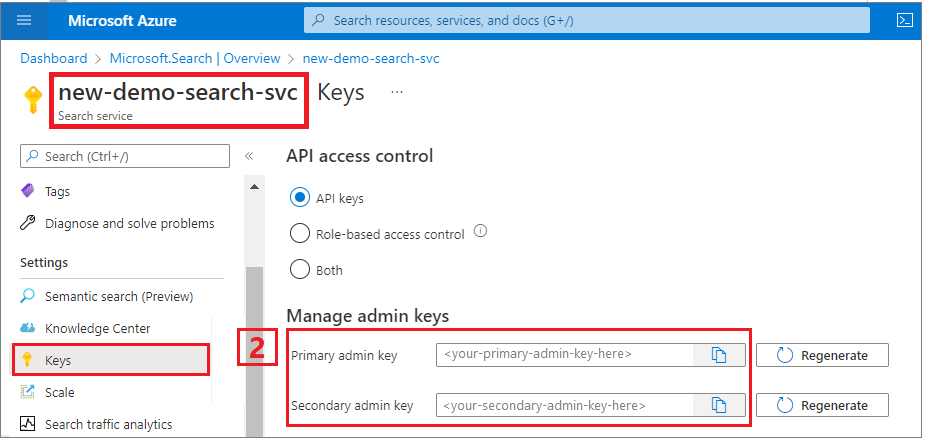
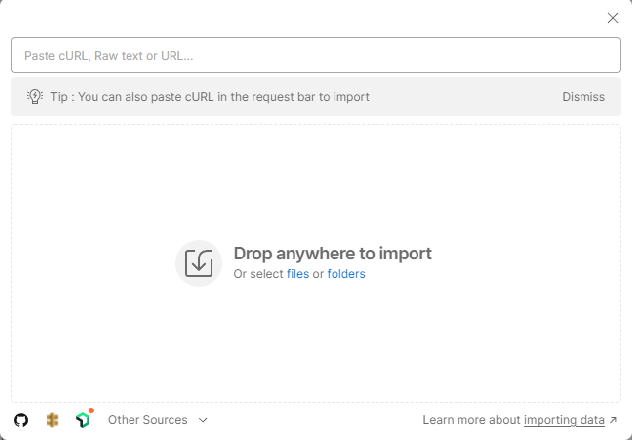
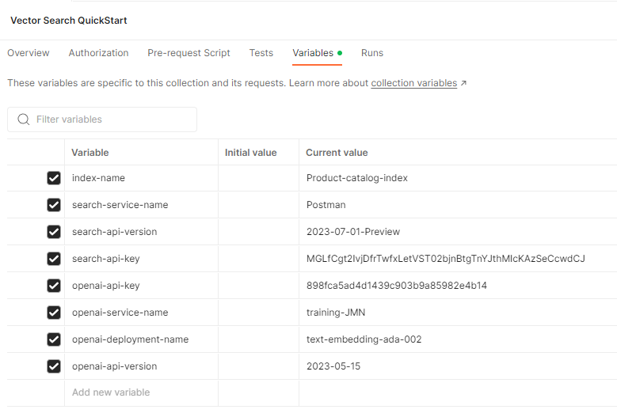

---
lab:
    title: 'Use the REST API to run vector search queries'
---

# Use the REST API to run vector search queries

In this exercise you'll set up your project, create an index, upload your documents, and run queries.

You'll need the following to successfully this exercise:

- The [Postman app](https://www.postman.com/downloads/)
- An Azure subscription
- Azure AI Search service
- The Postman sample collection located in this repository - *Vector-Search-Quickstart.postman_collection v1.0 json*.

> **Note**
> You can find more information about the Postman app [here](https://learn.microsoft.com/en-us/azure/search/search-get-started-rest) if required.

## Set up your project

First set up your project by carrying out the following steps:

1. Note the **URL** and **Key** from your Azure AI Search service.

    

1. Download the [Postman sample collection](https://github.com/MicrosoftLearning/mslearn-knowledge-mining/blob/main/Labfiles/10-vector-search/Vector%20Search.postman_collection%20v1.0.json).
1. Open Postman and import the collection by selecting the **Import** button and drag and drop the collection folder into the box.

    

1. Select the **Fork** button to create a fork of the collection and add a unique name.
1. Right-click your collection name and select **Edit**.
1. Select the **Variables** tab and enter the following values using the search service and index names from your Azure AI Search service:

    

1. Save your changes by selecting the **Save** button.

You're ready to send your requests to the Azure AI Search service.

## Create an Index

Next, create your index in Postman:

1. Select **PUT Create/Update Index** from the side menu.
1. Update the URL with your **search-service-name**, **index-name** and **api-version** that you noted earlier.
1. Select the **Body** tab to see the response.
1. Set the **index-name** with your index name value from your URL and select **Send**.

You should see a status code of type **200** which indicates a successful request.

## Upload Documents

There are 108 documents included in the Upload Documents request, each one has a full set of embeddings for the **titleVector** and **contentVector** fields.

1. Select **POST Upload Docs** from the side menu.
1. Update the URL with your **search-service-name**, **index-name** and **api-version** as before.
1. Select the **Body** tab to see the response and select **Send**.

You should see a status code of type **200** to show that your request was successful.

## Run Queries

1. Now try running the following queries on the side menu. To do this, make sure to update the URL each time as before and send a request by selecting **Send**:

    - Single Vector search
    - Single Vector search w/Filter
    - Simple hybrid search
    - Simple hybrid search w/Filter
    - Cross-field search
    - Multi-Query search

1. Select the **Body** tab to see the response and view the results.

You should see a status code of type **200** for a successful request.

### Clean-up

Now that you've completed the exercise, delete all the resources you no longer need. Start with the code cloned to your machine. Then delete the Azure resources.
